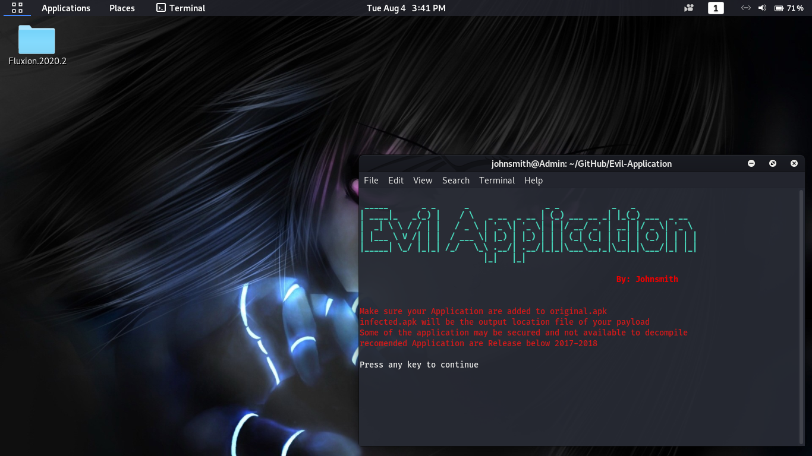
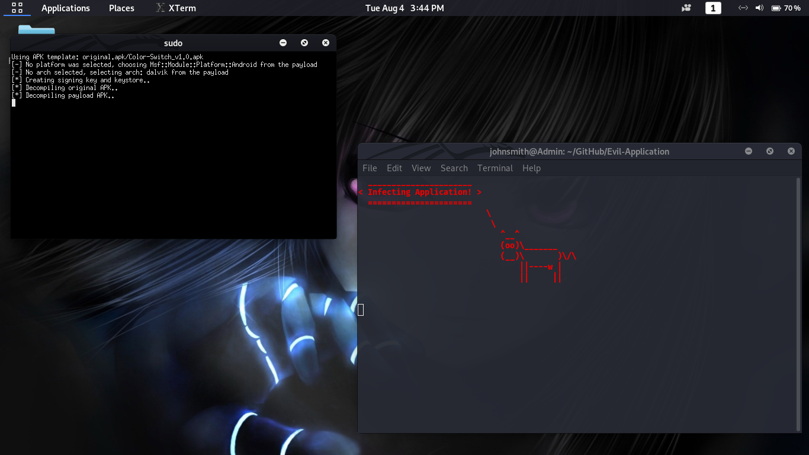
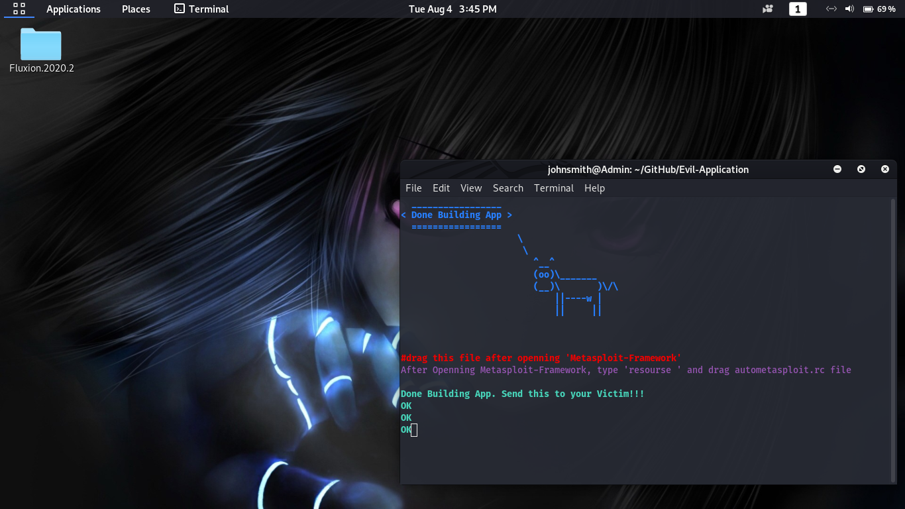
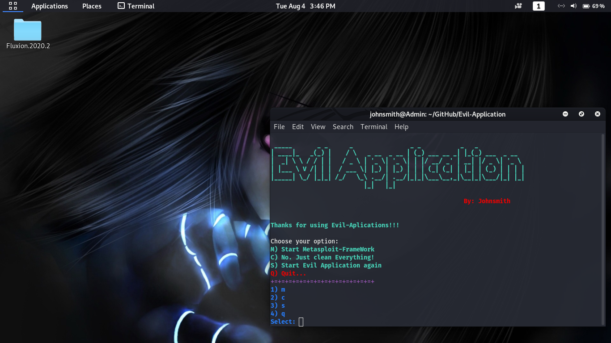

# Evil-Application

Its come with apktool version 2.4.1

check out other ver here: https://ibotpeaches.github.io/Apktool/

If you want upgraded version go to apktool_v2.4.1 directory

type:

    cd apktool_v2.4.1
    chmod +x *
    sudo ./install.sh or sudo bash install.sh

Install Missing Packages manually or run

type:

    chmod +x install.sh
    sudo ./install.sh or sudo bash install.sh

It will install all packages that are missing and it will automaticaly start...

Next use:

    sudo ./evil

Not all application will be able to decompile or recompile with this tool

tested on application release in 2018-2019

Dont use for illegal purposes,

im not responsible on any malicious use of this tool.

report issue here: https://github.com/johnsmith80/Evil-Application/issues

Will try to fegure out your problem with this tool.

Happy Learning!
